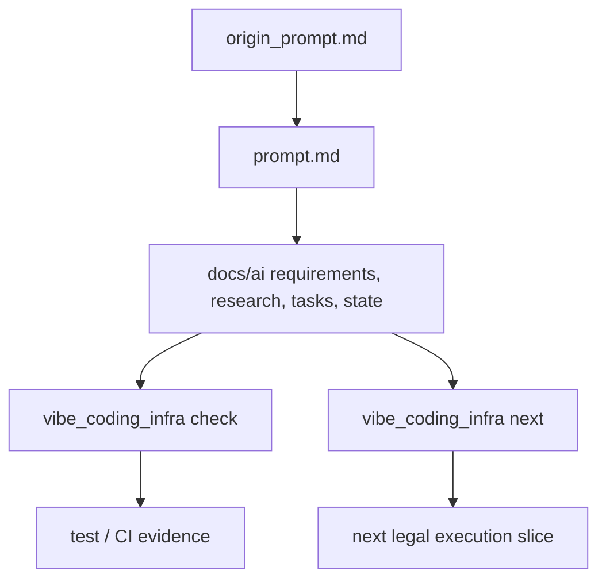

# Architecture

## Layers

1. `origin_prompt.md`：需求源。
2. `prompt.md`：规范源。
3. `docs/`：长期知识层，给人类维护者阅读。
4. `docs/ai/`：过程状态层，给 Agent 恢复上下文、判断授权和记录证据。
5. `schemas/`：机器可读约束层。
6. `vibe_coding_infra/`：本地质量门禁与下一步诊断层。

## Data Flow

## Boundary

`vibe_coding_infra` 不替 Agent 做产品决策。它只检查基础设施文件是否齐备、字段是否可读，并根据状态优先级诊断下一执行切片。
