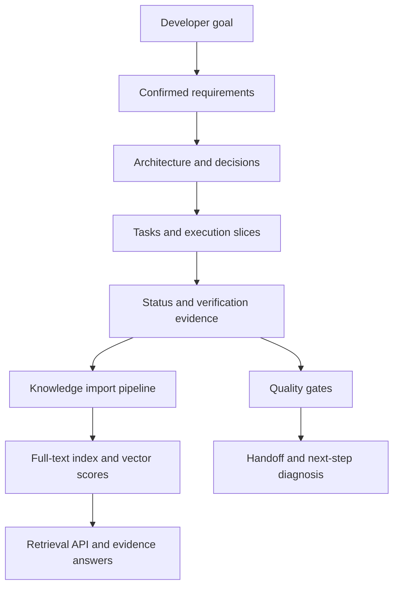

# Architecture

## Layers

1. **Agent Contract Layer**: Defines behavior, safety boundaries, execution protocol, quality gates, and knowledge rules.
2. **Human Documentation Layer**: Explains goals, architecture, development, testing, glossary, and knowledge strategy.
3. **Agent State Layer**: Stores requirements, research, decisions, tasks, execution slices, status, reports, risks, and handoff.
4. **Knowledge Layer**: Imports stable repository facts into a searchable and answerable index.
5. **Schema Layer**: Defines required machine-readable fields for state, slices, decisions, research, and knowledge entries.
6. **Tooling Layer**: Provides checks, next-step diagnosis, knowledge import, search, and answer commands.

## Data Flow

## Knowledge Boundary

The knowledge layer helps agents discover and cite facts. It does not override source files, P0 safety boundaries, developer confirmation, or the current legal execution slice. If a knowledge answer conflicts with source files, the agent must trace the evidence and record the conflict.

## Local Implementation

The first implementation uses only the Python standard library:

- Markdown and JSON files remain the auditable sources.
- `knowledge_index.json` is a local searchable index.
- Keyword matching provides full-text retrieval.
- Token vectors provide lightweight semantic scoring.
- Evidence answers return citations instead of hidden memory.
