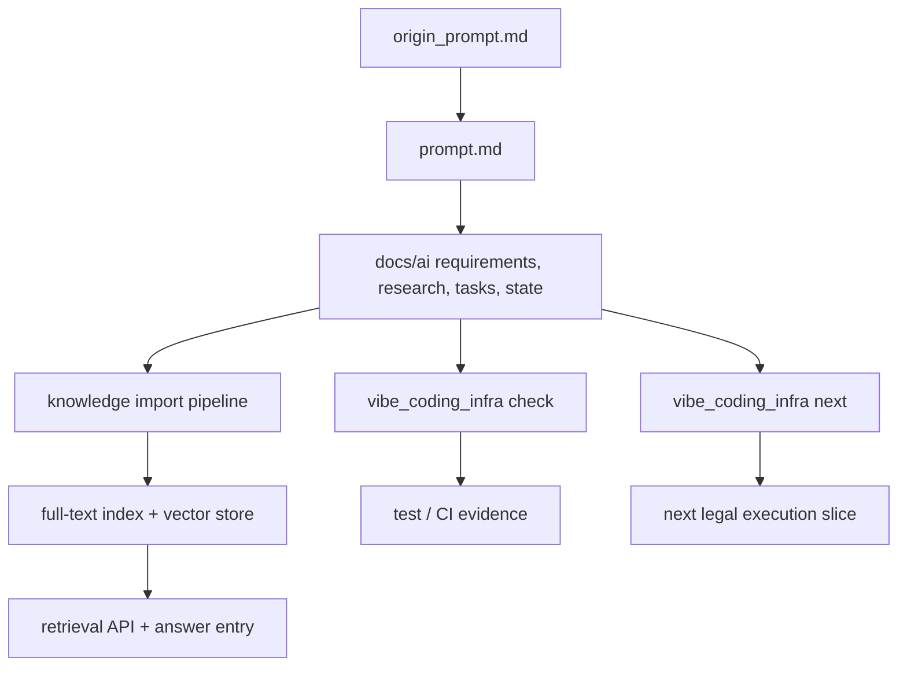

# Architecture

## Layers

1. `origin_prompt.md`：需求源。
2. `prompt.md`：规范源。
3. `docs/`：长期知识层，给人类维护者阅读。
4. `docs/ai/`：过程状态层，给 Agent 恢复上下文、判断授权和记录证据。
5. 专属编程知识库/RAG：稳定事实发现、检索增强和带证据问答层。
6. `schemas/`：机器可读约束层。
7. `vibe_coding_infra/`：本地质量门禁、下一步诊断和知识库核心层。

## Data Flow

## Boundary

`vibe_coding_infra` 不替 Agent 做产品决策。它检查基础设施文件是否齐备、字段是否可读，根据状态优先级诊断下一执行切片，并提供本地知识条目导入、全文检索、轻量词向量和证据问答基础能力。

知识库/RAG 层是独立产品形态，但不取代源文件审计。它的回答必须引用来源，不得绕过 P0 安全边界、开发者确认机制或当前唯一合法执行切片。
